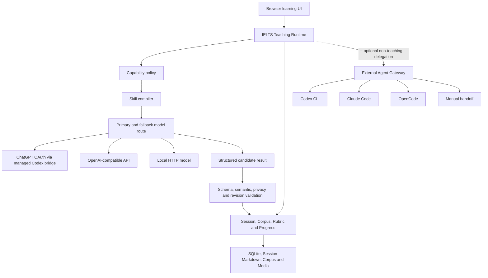

# IELTS AI Coach architecture V2

Status: implemented. This document is the authority for AI execution,
credentials, Skill compilation, persistence and the boundary between teaching
models and external Agents.

## 1. Product boundary

IELTS AI Coach is a local learning application. The product owns the teaching
workflow; a model supplies constrained inference inside that workflow.



FastAPI is the loopback application service. It serves the UI, exposes
deterministic operations, supervises inference jobs and calls the existing
Python Runtime. It is not a second IELTS rules engine and it is not a cloud
model backend.

## 2. Three concepts that must not be mixed

### Teaching Runtime

The Runtime owns:

- Writing evidence-first review and V1/V2 progression;
- Reading hints, answer locks and passage-grounded review;
- Speaking mock integrity;
- Listening attempts and error evidence;
- privacy, media permissions and minimum context;
- Session revision, idempotency and atomic persistence;
- score confidence and calibration status.

The Runtime is the only component allowed to turn a model result into an
authoritative learning record.

### Model Provider

A Model Provider supplies inference to the internal Teaching Runtime. Supported
provider kinds are:

- `codex_oauth_bridge`: ChatGPT login through the isolated managed Codex
  app-server;
- `openai_compatible`: a remote OpenAI-compatible HTTP API;
- `local_http`: a user-operated local OpenAI-compatible HTTP service.

The system keeps exactly one enabled primary provider and zero or more ordered
fallback providers. Provider selection is independent of IELTS capabilities.

Built-in presets only prefill connection metadata. DeepSeek, Qwen/DashScope,
GLM, Moonshot/Kimi and SiliconFlow all use the same
`openai_compatible` implementation. A preset does not bypass testing,
credential storage, Skill compilation or output validation.

### External Agent

Claude Code, OpenCode, Codex CLI and Manual handoff are external tools. They
are useful for corpus preparation, local file conversion, batch import and
developer workflows. They are not eligible to become the primary teaching
model.

This separation prevents CLI discovery, login, PATH and terminal-output changes
from breaking normal IELTS practice.

## 3. Capability and Skill compiler

Every AI-assisted action resolves to a versioned capability. A capability
defines:

- its IELTS module and action;
- the authoritative Skill name;
- minimum Session and learner context;
- privacy and media scope;
- allowed tools;
- output contract and JSON Schema;
- persistence owner.

Before inference, the Skill compiler loads the complete editable source from
`skills-source/<skill>/SKILL.md`, required Markdown references and the output
Schema. It produces a hashed Skill Envelope. The request records that hash so
historical feedback can be traced to the policy used at generation time.

Compiled destinations under `.claude/skills`, `.agents/skills` and
`.opencode/skills` are not used as the source. They remain generated artifacts
of `ielts-coach sync-skills`.

Wheel builds copy the canonical `skills-source/` tree into package resources at
build time. Installed applications read that generated package copy; developers
continue to edit only `skills-source/`.

## 4. Provider execution and provenance

An inference job persists:

```text
capability_id
output_contract
model_provider_id
provider route (primary plus fallbacks)
Skill source hash
actual provider/model identity
usage and timing
calibration status
status and recovery action
```

The Provider chain tries the primary route first and then configured fallbacks.
Each provider is one complete, auditable Attempt:

```text
invoke provider
-> validate JSON Schema
-> validate deterministic IELTS teaching rules
-> accept candidate or continue to the next provider
```

Transport success alone never ends the route. A structurally invalid response,
a response that violates Reading/Writing/Speaking integrity, or a provider that
cannot process required media is recorded and causes the next eligible fallback
to run. Attempt records contain failure stage, error code, provider/model
identity, usage metadata and a result hash; they do not duplicate private model
output. Models never receive a database connection and never write Session
files.

The deterministic pipeline test remains available only as a developer check.
It reports that no model was used, never emits an IELTS score and never becomes
learner feedback.

## 5. Credentials and privacy

Provider records in SQLite contain only non-secret configuration and a
credential reference. API keys are stored under:

```text
IELTS_HOME/private/credentials.json
```

On Windows they are protected with DPAPI and tied to the current user and
machine. Other platforms use a private owner-only file fallback. Credential
values are never returned by the HTTP API, written into Agent runs or included
in learning backups.

The managed Codex runtime uses isolated locations:

```text
IELTS_HOME/private/runtimes/codex/<pinned-version>
IELTS_HOME/private/codex-managed
```

It does not modify the user's global Codex login. Installation and ChatGPT
login both require explicit user actions.

## 6. Data and database decision

SQLite in WAL mode remains the production database for the local single-user
application. Session Markdown, registered Corpus files and Media assets remain
first-class local data alongside it.

Docker is not a database choice and is not a runtime dependency. Adding
Docker/WSL/PostgreSQL now would introduce:

- a second service lifecycle behind the desktop shortcut;
- Windows/WSL path translation for Corpus and Media;
- additional OAuth and localhost boundaries;
- more complex backup and restore;
- idle resource cost without solving a current concurrency problem.

Docker can be considered later for CI or an optional isolated OCR/audio worker.
PostgreSQL requires a separate cloud, multi-user or remote-concurrency product
decision. Any future database change must preserve SQLite import/export and
the Runtime's exclusive persistence ownership.

Schema v19 added provider routes, external-Agent profiles and inference
provenance. Schema v20 added persistent Study Threads, messages and attachment
metadata. Schema v21 adds immutable Provider Attempt audit records and closes
unfinished attempts during cancellation, timeout or service-restart recovery.
Schema v22 adds per-run input hashes, durable checkpoints, expiring worker
leases, heartbeats, resume counters and canonical persistence receipts. An
expired run that already stored a candidate resumes validation and persistence
without another model call; a run interrupted before any candidate exists
fails explicitly and can be retried by the learner.
Migrations retain pre-migration snapshots and remain compatible with V0.1 user
data.

## 7. Product information architecture

Normal learning pages contain only learning concerns:

```text
Today
Practice
Library
Progress
```

Settings is visually and structurally separate:

```text
Settings
├─ Profile
├─ Models
├─ Data and backups
├─ Teaching trust
├─ Advanced
│  ├─ Local HTTP models
│  └─ External Agents
└─ System health
```

Today is not a general chat product. The four module shortcuts, one resumable
activity and one recommendation remain deterministic learning entry points.
The material composer creates a separate persistent Study Thread for
user-supplied IELTS questions, documents and close-reading selections. Study
Threads retain their own attachments and validated replies without becoming
formal score Sessions; an explicit promotion action sends selected material to
the OCR and local-review pipeline.

On first use, the learner may choose:

1. ChatGPT login (recommended);
2. their own OpenAI-compatible API;
3. configure AI later.

Deterministic practice, corpus browsing and history remain usable without a
model connection.

## 8. Operational and performance boundary

The local service remains Python/FastAPI and the UI remains
React/TypeScript/Vite. No additional language is justified until profiling
identifies a native hot path.

Scale work should first use:

- SQLite indexes and query-plan regression tests;
- pagination and bounded bootstrap responses;
- lazy-loaded frontend routes;
- background import/OCR/audio work;
- registered media streaming instead of eager loading;
- measured slow-route and database telemetry.

Rust, Go, a vector database or a separate service must be introduced only for
a measured bottleneck or a separately approved product capability.

## 9. Acceptance criteria

The architecture is accepted when:

- a clean home starts with no implicit paid or remote model;
- one primary and optional fallback providers can be configured;
- secrets never appear in SQLite or API responses;
- complete Skills and Schemas are compiled for every model call;
- external Agents cannot be selected for teaching inference;
- provider output must pass validation before persistence;
- schema v22 migrates historical homes with a recoverable snapshot;
- normal learning works without exposing provider configuration;
- frontend build, lint and tests plus backend regression tests pass.
