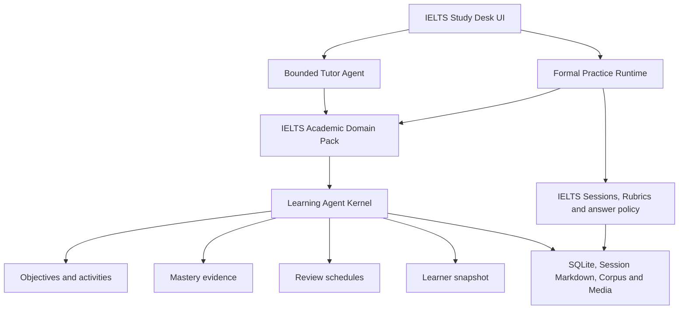

# Learning Agent Kernel

Status: implemented foundation. This document defines the boundary between the
reusable learning kernel and the IELTS Academic product domain.

## 1. Product decision

言蹊 (Yanxi) ships with General English as the default learning track;
IELTS Academic is the first optional exam Domain Pack on the same reusable
kernel. The product does not expose a subject marketplace or a generic
course builder.

Internally, however, longitudinal learning state is no longer hard-coded as a
collection of IELTS-only progress queries. The architecture is:



This split prepares the system for future English-learning tracks without
weakening the IELTS rules that already exist.

## 2. Authority boundaries

| Concern | Owner | Notes |
|---|---|---|
| IELTS task rules, answer reveal and scoring admission | IELTS Teaching Runtime | Remains authoritative |
| Model calls and fallback | Model Provider layer | Does not own learning state |
| Dialogue planning | bounded Tutor Agent | Can read state and propose actions |
| Track vocabulary, dimensions and evidence mapping | Domain Pack | Versioned product policy |
| Objectives, activities, mastery evidence and review timing | Learning Agent Kernel | Generic, local and deterministic |
| Formal learning records | Runtime persistence layer | Models cannot write directly |

The Learning Agent Kernel does not score an IELTS response. It consumes only
evidence that has already been admitted by the IELTS Runtime, or explicit
learner-authored evidence whose lower confidence is preserved.

## 3. Domain Pack contract

A Domain Pack declares:

- one stable `track_id`;
- learner-visible title, language and lifecycle status;
- learning dimensions and skill nodes;
- a default skill for evidence that cannot be classified more narrowly;
- model-assisted Capabilities and their output contracts;
- the assessment scale used to normalise admitted scores;
- deterministic mappings from domain evidence labels to skill nodes;
- the teaching-policy identifier used by the Tutor and Runtime.

The registered default pack is `ielts-academic`. It contains four dimensions,
21 initial skill nodes and the existing nine IELTS Capabilities. Adding a
future track must not add conditionals throughout the web service. It must
define a pack, its policies, its Skills, its contracts and its own conformance
tests.

Domain Packs are code-owned product definitions. Learners cannot edit them
through the browser, and imported content cannot register executable policy.

## 4. Generic learning records

Schema v31 added the following local records:

| Record | Purpose |
|---|---|
| `learning_skill_nodes` | persisted, queryable projection of pack-defined skills |
| `learning_objectives` | revisioned learner goals with target skills and dates |
| `learning_activities` | planned or completed units of study linked to an objective |
| `mastery_evidence` | append-only or idempotently upserted evidence for one skill |
| `skill_mastery` | deterministic aggregate derived from recent evidence |
| `learning_review_schedules` | due dates and spaced-review state for a skill |

Existing tables gain a compatible `track_id`, defaulting to
`ielts-academic`. Sessions may also link to a generic learning activity.
Historical homes are migrated in place after the normal recoverable
pre-migration snapshot.

## 5. Evidence and mastery semantics

Every mastery evidence row records:

- track, dimension and skill;
- evidence kind and source reference;
- a normalised result between 0 and 1;
- confidence between 0 and 1;
- provenance metadata and occurrence time;
- an idempotency key when the source can be replayed.

Evidence kinds have intentionally transparent weights:

| Evidence kind | Weight |
|---|---:|
| formal assessment | 1.25 |
| completed review | 1.10 |
| practice attempt | 1.00 |
| tutor observation | 0.70 |
| learner self-report | 0.35 |

The current mastery estimate is a weighted mean of at most the 20 newest
evidence rows. Newer evidence receives a `0.92 ^ index` recency factor. The
stored confidence reflects both evidence confidence and sample coverage.
Unobserved skills have no mastery row. Observed status labels are descriptive
(`needs_support`, `developing`, `secure`, `strong`; `unknown` is retained for a
projection whose evidence was removed), not official IELTS judgements and not
a replacement for admitted ScoreResult data.

The formula is deliberately deterministic and inspectable. It should be
changed only with evaluation evidence and a versioned migration strategy, not
by silently introducing an opaque model prediction.

## 6. IELTS Session projection

When the Runtime commits a validated IELTS Session, it projects eligible
signals into the generic model in the same SQLite transaction:

- Reading and Listening question outcomes become attempt evidence, classified
  by the Domain Pack's question-type mappings;
- Writing and Speaking admitted criterion scores become assessment evidence,
  normalised from the IELTS 0–9 scale;
- a cautious module-level fallback is used only when an accepted score exists
  but no more specific evidence is available.

Projection identifiers are stable. Re-saving or recovering the same Session
does not duplicate mastery evidence. The Session remains the source of truth;
the generic records are a queryable learning projection.

## 7. Review scheduling

Accepted evidence maintains one review schedule per skill. Initial intervals
use 1, 3, 7 and 14 days according to the current estimate. Completing a review
records fresh review evidence and deterministically advances or shortens the
next interval based on performance.

This generic schedule coexists with existing IELTS-specific review tasks.
Tutor snapshots combine both sources but keep their provenance explicit so a
model cannot mistake a recommendation for a formal assessment.

## 8. Versioned learner memory

Schema v32 replaces overwrite-only personalisation with an explicit memory
lifecycle. A memory has a stable semantic key, content hash, revision,
provenance kind, validity state, optional expiry and access metadata. Every
material change writes an immutable revision snapshot.

Runtime distinguishes four validity states:

- `current`: eligible for bounded Tutor context;
- `conflicted`: excluded until the learner resolves the contradiction;
- `superseded`: retained as history but no longer used;
- `expired`: excluded at read time after its UTC expiry.

Creating the same effective statement twice is idempotent. Different active
statements with the same semantic key create a conflict record; neither is sent
to the Tutor until the learner chooses one, keeps both deliberately or dismisses
both. Editing, dismissing or expiring a memory recomputes affected conflicts.
Only effective memories are loaded into Tutor context, and reads update access
metadata so later retention policy can be based on observable use. Memory can
personalise language, explanation order and study choices; it cannot alter
scores, answer keys, privacy decisions or Session evidence.

## 9. Runtime-owned teaching cycles

Schema v32 also adds an explicit teaching state machine:

```text
diagnose -> teach -> guided practice -> independent practice
                                      -> assess -> review -> consolidate
```

The full graph is deliberately non-linear so weak evidence can return a learner
to instruction or guided practice. Every transition requires a current revision
and is appended to an event stream with source and evidence references. Only the
learner or Runtime may mutate a cycle. A model may recommend a next move, but it
cannot apply one. Validated Tutor output contributes a bounded observation;
formal Session milestones are projected idempotently inside the Session commit.
Tutor prose and hidden reasoning never become state-machine data.

## 10. Teaching-quality evaluation

The release gate now contains a second, deterministic suite in addition to JSON
contract conformance. It tests positive and negative controls across:

- instructional fit;
- Reading/Speaking answer integrity;
- evidence grounding;
- Writing active-learning order;
- memory continuity and invalid-memory exclusion;
- teaching-state authority and revision checks;
- privacy-safe bounded recovery.

Evaluation history stores case hashes, rule outcomes and aggregate scores only;
raw learner or fixture content is not retained. This gate proves the encoded
policy behaviour, not subjective teaching excellence. Human review and future
model-assisted judging may supplement it, but cannot replace deterministic
answer-integrity and persistence checks.

## 11. Local API

The loopback service exposes the kernel through:

```text
GET   /api/v1/learning-tracks
GET   /api/v1/learning-tracks/{track_id}
GET   /api/v1/learning-model
GET   /api/v1/learning-skills
GET   /api/v1/learning-objectives
POST  /api/v1/learning-objectives
PATCH /api/v1/learning-objectives/{objective_id}
GET   /api/v1/learning-activities
POST  /api/v1/learning-activities
PATCH /api/v1/learning-activities/{activity_id}
GET   /api/v1/mastery-evidence
POST  /api/v1/mastery-evidence
GET   /api/v1/learning-reviews
POST  /api/v1/learning-reviews/{review_id}/complete
PATCH /api/v1/learning-reviews/{review_id}/status
GET   /api/v1/learner-memories
POST  /api/v1/learner-memories
PATCH /api/v1/learner-memories/{memory_id}
GET   /api/v1/learner-memories/{memory_id}/revisions
GET   /api/v1/learner-memory-conflicts
POST  /api/v1/learner-memory-conflicts/{conflict_id}/resolve
GET   /api/v1/teaching-cycles
POST  /api/v1/teaching-cycles
GET   /api/v1/teaching-cycles/{cycle_id}
GET   /api/v1/teaching-cycles/{cycle_id}/recommendation
POST  /api/v1/teaching-cycles/{cycle_id}/transition
PATCH /api/v1/teaching-cycles/{cycle_id}/status
GET   /api/v1/system/teaching-evaluations
```

These endpoints are local UI/runtime contracts, not a hosted public API.
Browser mutation requests retain the existing local session and CSRF boundary.

## 12. Compatibility and non-goals

- SQLite remains the production database. Docker, PostgreSQL and a vector
  database are not introduced.
- Existing IELTS Session, Corpus, Progress, review and scoring APIs continue to
  work.
- Public builds still start with an empty question bank and no learner data.
- No current screen asks the learner to choose a non-existent learning track.
- A Domain Pack cannot relax privacy, model-output validation or persistence
  authority.
- Skills remain sourced only from `skills-source/`.

## 13. Remaining product decisions

The reusable kernel, versioned memory, explicit pedagogy state machine and
teaching-policy evaluation gate are implemented. The remaining expansion work
is intentionally not activated by infrastructure alone:

1. a General English pilot centred on contextual vocabulary and close reading
   requires a separately approved curriculum, Skills, contracts and evaluation
   set before its Domain Pack is registered;
2. user-facing objective, memory-conflict and skill-progress surfaces should be
   introduced only after representative local data proves that the concepts are
   understandable and useful;
3. subjective lesson-quality review needs a curated, redistributable evaluation
   corpus and a human rubric before it can become a release signal.

The next track should be a product decision backed by curriculum and test
evidence. It must not be created merely because the kernel can now store it.
